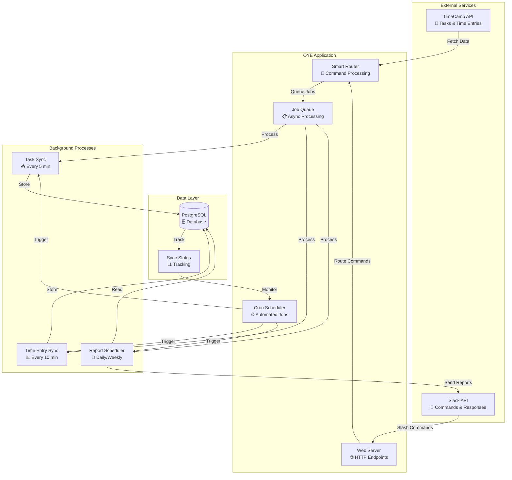
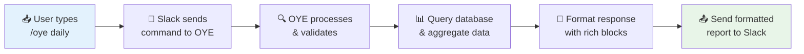

# Observe-Yor-Estimates Documentation

Welcome to the comprehensive documentation for the OYE (Observe-Yor-Estimates) project - a powerful TimeCamp to Slack integration system that brings time tracking insights directly to your team's workflow.

## 🎯 Project Overview

OYE is a monolithic Go application that bridges TimeCamp time tracking with Slack notifications, providing real-time insights and automated reporting for your team's time management.

### Key Features

- **📊 Real-time sync** between TimeCamp and PostgreSQL database
- **💬 Slack slash commands** for on-demand reporting
- **⏰ Automated scheduling** for periodic updates and threshold monitoring
- **👥 User management** for proper name display in reports
- **⚠️ Threshold alerts** for tasks exceeding estimated time
- **🔄 Smart routing** with asynchronous job processing

## 🏗️ System Architecture



## 📚 Documentation Structure

### 🚀 Getting Started

| Document | Purpose | Time to Complete |
|----------|---------|------------------|
| [🏁 **Quick Start Guide**](QUICK_START.md) | Get up and running in minutes | **⏱️ 5-10 min** |
| [🔧 **Installation & Setup**](INSTALLATION.md) | Complete setup guide for dev & prod | **⏱️ 15-30 min** |
| [⚙️ **Configuration**](CONFIGURATION.md) | Environment variables and options | **⏱️ 5 min** |

### 🏗️ Development & Architecture

| Document | Purpose | Key Features |
|----------|---------|--------------|
| [🏛️ **Architecture Overview**](ARCHITECTURE.md) | System design and component overview | **📊 Visual diagrams** |
| [🔌 **API Reference**](API_REFERENCE.md) | Complete API endpoints and usage | **📋 Technical specs** |
| [🗄️ **Database Schema**](DATABASE.md) | Database structure and relationships | **🔗 Entity diagrams** |
| [👨‍💻 **Development Guide**](DEVELOPMENT.md) | Development workflow and guidelines | **🛠️ Best practices** |

### 🚀 Operations & Deployment

| Document | Purpose | Environment |
|----------|---------|-------------|
| [🌐 **Deployment Guide**](DEPLOYMENT_GUIDE.md) | Production deployment instructions | **🏭 Production** |
| [👥 **User Management**](USER_MANAGEMENT.md) | Managing users in the system | **🔧 Operations** |
| [🔍 **Monitoring & Troubleshooting**](TROUBLESHOOTING.md) | Common issues and solutions | **🚨 Debug workflows** |
| [💻 **CLI Commands**](CLI_COMMANDS.md) | Complete command-line interface | **📋 Reference** |

### 💬 Features & Integration

| Document | Purpose | Integration |
|----------|---------|-------------|
| [💬 **Slack Integration**](SLACK_INTEGRATION.md) | Slack slash commands and setup | **🔄 Visual workflows** |
| [⏰ **Time Tracking**](TIME_TRACKING.md) | TimeCamp integration and sync | **📊 Data flow** |
| [📅 **Scheduled Tasks**](SCHEDULED_TASKS.md) | Automated sync and reporting jobs | **⏰ Automation** |
| [📊 **Threshold Monitoring**](THRESHOLD_MONITORING.md) | Task estimation monitoring | **⚠️ Alerts** |

### 🔧 Advanced Topics

| Document | Purpose | Audience |
|----------|---------|----------|
| [🛡️ **Security**](SECURITY.md) | Security considerations and practices | **🔒 Admins** |
| [🚀 **Performance**](PERFORMANCE.md) | Performance optimization and scaling | **📈 Engineers** |
| [🤝 **Contributing**](CONTRIBUTING.md) | How to contribute to the project | **👥 Contributors** |
| [📋 **Changelog**](CHANGELOG.md) | Version history and changes | **📊 History** |

## 🔍 Quick Navigation

### 🎯 Common Tasks

| Need to... | Go to | Estimated Time |
|------------|-------|----------------|
| **Set up locally** | [🏁 Quick Start](QUICK_START.md) | 5-10 minutes |
| **Deploy to production** | [🌐 Deployment Guide](DEPLOYMENT_GUIDE.md) | 15-30 minutes |
| **Add/manage users** | [👥 User Management](USER_MANAGEMENT.md) | 5 minutes |
| **Configure Slack** | [💬 Slack Integration](SLACK_INTEGRATION.md) | 10 minutes |
| **Troubleshoot issues** | [🔍 Troubleshooting](TROUBLESHOOTING.md) | As needed |
| **Use CLI commands** | [💻 CLI Commands](CLI_COMMANDS.md) | Reference |

### 🆘 Quick Help

| Problem | Solution | Time |
|---------|----------|------|
| **🚨 App not responding** | [Health Check Guide](TROUBLESHOOTING.md#health-check-script) | 2 min |
| **💬 Slack not working** | [Slack Debug Flow](TROUBLESHOOTING.md#slack-integration-issues) | 5 min |
| **📊 No data syncing** | [Sync Troubleshooting](TROUBLESHOOTING.md#data-synchronization-issues) | 10 min |
| **🗄️ Database issues** | [DB Connection Guide](TROUBLESHOOTING.md#database-connection-problems) | 5 min |

## 📋 Prerequisites

Before getting started, ensure you have:

| Component | Version | Purpose |
|-----------|---------|---------|
| **Go** | 1.18+ | Application runtime |
| **PostgreSQL** | 12+ | Database storage |
| **TimeCamp Account** | Active | Time tracking data source |
| **Slack Workspace** | Admin access | Command interface |

## 🚀 Getting Started

Choose your path based on your goal:

### 🏁 Quick Demo (5 minutes)
```bash
# Clone and run locally
git clone <repo-url>
cd observe-yor-estimates
go run . --version
```
👉 **Continue with**: [Quick Start Guide](QUICK_START.md)

### 🌐 Production Deployment (15 minutes)
```bash
# Deploy to Railway/Docker/Binary
# Full setup with environment config
```
👉 **Continue with**: [Deployment Guide](DEPLOYMENT_GUIDE.md)

### 👨‍💻 Development Setup (30 minutes)
```bash
# Complete development environment
# Database setup, testing, debugging
```
👉 **Continue with**: [Installation Guide](INSTALLATION.md)

## 🔄 Typical Workflow



## 📊 Sample Commands

Once set up, you can use these commands in Slack:

### 📈 Daily Operations
```bash
/oye daily          # Personal daily summary
/oye weekly public  # Team weekly report  
/oye sync           # Refresh data from TimeCamp
```

### ⚠️ Monitoring
```bash
/oye over 80 weekly   # Tasks over 80% of estimate
/oye over 100 daily   # Tasks over budget
```

### 🔧 Management
```bash
/oye help            # Show all commands
/oye full-sync       # Complete data refresh
```

## 🛠️ Technical Stack

| Component | Technology | Purpose |
|-----------|------------|---------|
| **Backend** | Go 1.18+ | Core application logic |
| **Database** | PostgreSQL | Data persistence |
| **Scheduling** | Cron jobs | Automated tasks |
| **Integration** | REST APIs | TimeCamp & Slack |
| **Deployment** | Docker/Binary | Production hosting |

## 📖 Additional Resources

### 🌐 External Documentation
- [TimeCamp API Documentation](https://developer.timecamp.com/)
- [Slack API Documentation](https://api.slack.com/)
- [PostgreSQL Documentation](https://www.postgresql.org/docs/)

### 🔗 Project Links
- [📁 Project Repository](../) - Main codebase
- [🐛 Issue Tracker](../issues) - Bug reports and feature requests
- [📊 Project Board](../projects) - Development progress

## 🤝 Contributing

We welcome contributions! Here's how to get started:

1. **📖 Read**: [Contributing Guide](CONTRIBUTING.md)
2. **🍴 Fork**: Create your feature branch
3. **🧪 Test**: Ensure all tests pass
4. **📝 Document**: Update relevant documentation
5. **🔄 Submit**: Create a pull request

## 📞 Support

### 🆘 Getting Help

| Type | Resource | Response Time |
|------|----------|---------------|
| **📚 Documentation** | This guide | Immediate |
| **🔍 Troubleshooting** | [Debug Guide](TROUBLESHOOTING.md) | Self-service |
| **🐛 Bug Reports** | [Issues](../issues) | 1-2 days |
| **💡 Feature Requests** | [Discussions](../discussions) | Weekly review |

### 📋 Before Reporting Issues

Please check:
- [ ] [Troubleshooting Guide](TROUBLESHOOTING.md) for common solutions
- [ ] [Known Issues](../issues) for existing reports
- [ ] [Documentation](.) for configuration help

## 📊 Documentation Health

This documentation is actively maintained and includes:

- ✅ **Visual diagrams** for complex concepts
- ✅ **Step-by-step guides** with time estimates
- ✅ **Troubleshooting workflows** with decision trees
- ✅ **Code examples** for all major features
- ✅ **Cross-references** between related topics

---

*This documentation is automatically maintained and updated with each release. Last updated: $(date)*

**🎯 Ready to get started?** Choose your path: [Quick Start](QUICK_START.md) | [Installation](INSTALLATION.md) | [Deployment](DEPLOYMENT_GUIDE.md) 